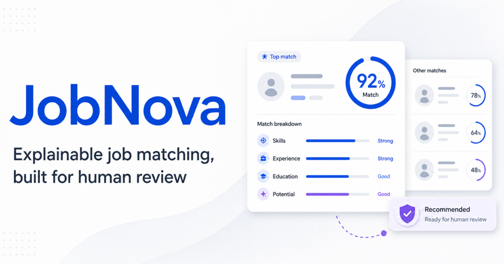
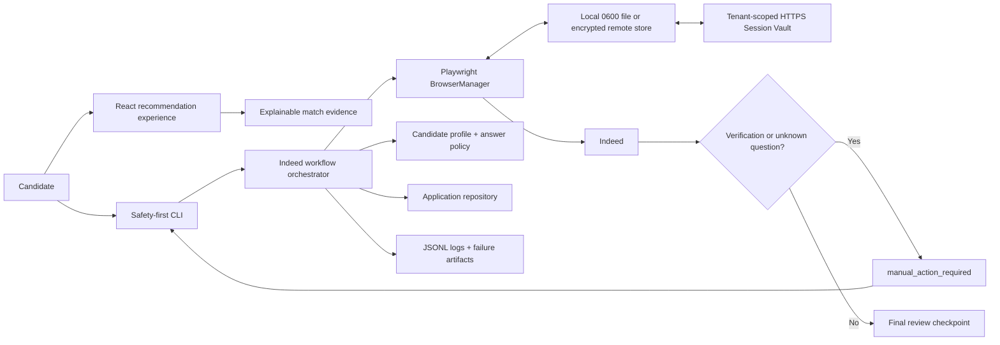
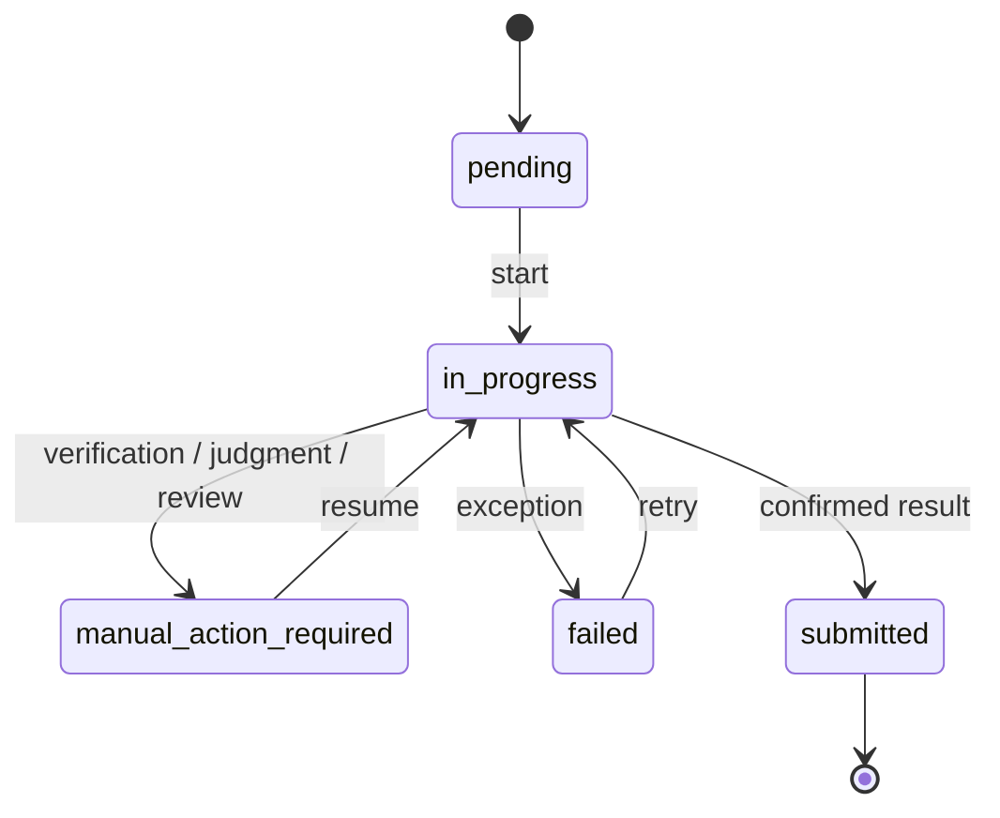

# JobNova — Explainable Recommendations & Safe Apply

[](https://github.com/b2ty9t7yhz-source/jobnova-takehome/actions/workflows/ci.yml)

[**Open the public frontend demo →**](https://jobnova-jinhan-takehome.jessica2134.chatgpt.site) · [Browse the source](https://github.com/b2ty9t7yhz-source/jobnova-takehome) · [Download v1.0.0](https://github.com/b2ty9t7yhz-source/jobnova-takehome/releases/tag/v1.0.0) · [Read the design decisions](./docs/DESIGN_DECISIONS.md)



JobNova is a polished, production-minded take-home prototype that connects two parts of the job-search journey:

1. an explainable job recommendation experience based on the supplied Figma direction; and
2. a resumable, review-first Indeed application workflow that treats human judgment and platform verification as explicit boundaries.

The project is intentionally a focused vertical slice—not a high-volume application bot. Its engineering depth comes from clear state, safe defaults, recovery, observability, and testable decisions.

## Product story

```text
Discover a role
  → understand the match
  → review the evidence and gaps
  → start an application
  → fill only known information
  → pause for verification or judgment
  → review before submit
  → persist the outcome
```

## What makes this more than a basic submission

- **Figma-informed product system:** reusable design tokens, high-fidelity cards, recommendation detail, and a responsive mobile information architecture.
- **Explainable matching:** the UI shows category evidence and a documented deterministic weighting instead of presenting an unexplained “AI” score.
- **Reproducible recommendation receipts:** every detail view exposes profile, policy, job, and evidence IDs so a reviewer can reconstruct why the recommendation appeared.
- **Explicit workflow state machine:** every application has status, step, attempts, transition history, manual action context, and failure context.
- **Review-first automation:** the default path stops at final review. Submission requires both `--confirm-submit` and an action-time `SUBMIT` confirmation.
- **Human-in-the-loop boundaries:** CAPTCHA, SMS, email, device verification, unknown questions, external application pages, and sensitive/legal questions pause instead of being guessed or bypassed.
- **Recovery and observability:** local atomic persistence, structured JSONL logs, screenshots on failure, session restoration, and a `resume` command.
- **End-to-end encrypted remote sessions:** an HTTPS client encrypts Playwright state with AES-256-GCM before PUT, while the repository-provided tenant-scoped Session Vault validates and atomically stores ciphertext-only envelopes; plaintext cookies never reach the service.
- **Bounded role selection:** a validated job plan contains one to three candidate-reviewed Indeed roles, each with a written fit reason.
- **Duplicate protection:** normalized Indeed job IDs prevent accidental repeated applications.
- **Evidence-backed quality:** strict TypeScript, ESLint, unit/integration-style component tests, and production builds.

## Architecture



> Local mode protects session and application files with restrictive filesystem permissions and Git exclusion. Remote mode encrypts session state on the client with AES-256-GCM before transfer. Application records remain local in this prototype.

## Repository layout

```text
jobnova-takehome/
├── packages/
│   ├── web/                    # React + Vite recommendation product
│   │   ├── src/components/     # Reusable Figma-informed UI
│   │   ├── src/data/           # Demo job fixtures
│   │   └── src/lib/            # Explainable scoring and filtering
│   └── automation/             # TypeScript + Playwright backend
│       ├── data/               # Safe profile and bounded job-plan examples
│       ├── src/browser/        # Browser lifecycle and session restore
│       ├── src/demo/           # Isolated synthetic workflow scenarios
│       ├── src/domain/         # Status and state-machine model
│       ├── src/indeed/         # Workflow, gates, and field policy
│       ├── src/observability/  # Structured logs and screenshots
│       ├── src/profile/        # Profile validation and answer policy
│       ├── src/storage/        # Atomic records + local/remote session adapters
│       └── src/session-vault/  # Runnable ciphertext-only HTTPS service
├── .env.example
├── .gitignore
├── CHALLENGE_AUDIT.md
├── README.md
├── SUBMISSION_CHECKLIST.md
└── WALKTHROUGH.md
```

## Quick start

Reviewers can use the public demo above without installing dependencies. The commands below reproduce the full local project, including tests and the private backend workflow.

Requirements:

- Node.js 22+
- npm 10+

Install and run the frontend:

```bash
npm install
npm run dev
```

Open `http://127.0.0.1:4173`.

Run every local quality gate:

```bash
npm run check
```

Or run the complete synthetic reviewer path, including backend browser tests, desktop/mobile frontend E2E, all five workflow statuses, encrypted session restore, and the final-review stop:

```bash
npm run reviewer:demo
```

## Zero-risk backend demo (recommended)

The complete status lifecycle can be demonstrated without opening Indeed, using a candidate profile, or making a network request:

```bash
npm run demo:seed
npm run demo:status
npm run demo:session
npm run demo:workflow
```

The first two commands write five clearly labeled synthetic records to the isolated `runtime/demo/applications.json` store: `pending`, `in_progress`, `manual_action_required`, `failed`, and `submitted`. The demo `submitted` record is a state-machine fixture—not evidence of a real application—and every record has `source: "demo"`.

`demo:session` performs a separate synthetic acceptance test: a fake Playwright session is encrypted in the client, sent through the same remote-store contract to the tenant-scoped Session Vault, persisted atomically, restored, authenticated, and compared with the original. It also proves that the plaintext test cookie is absent from the vault file. It opens no browser and makes no network request.

`demo:workflow` is the strongest end-to-end acceptance path. It launches headless Chromium and runs the real `IndeedWorkflow` against synthetic Indeed/Smart Apply pages while intercepting **every** browser request locally. The same field filler enters contact, location, exact radio/checkbox answers, and a synthetic resume, advances through the form, persists six transition events, and stops at final review. The fixture asserts that zero submit requests were sent.

Together these commands exercise transition history, failure context, CAPTCHA pausing, encrypted session restore, browser-backed form completion, and status reporting while keeping live application data separate. Re-running `demo:seed` is idempotent. Only `demo:workflow` opens a browser process, and it cannot reach the network.

A private live acceptance run can be reconciled into the ignored `runtime/applications.json` store after an authoritative Indeed confirmation. Live account details, resumes, email evidence, and application identifiers never belong in the repository or submission archive.

## Frontend experience

The frontend implements:

- Figma-aligned sidebar, status tabs, recommendation cards, match rings, AI mock-interview surfaces, job details, and fit explanation panel;
- search across roles, companies, locations, work modes, and skills;
- work-mode and minimum-match filters;
- saved-job shortlist;
- deterministic match ordering;
- loading, empty, and no-results states;
- list-to-detail navigation;
- refreshable job-detail deep links and copyable share links;
- desktop, tablet, and mobile layouts;
- mobile bottom navigation and full-width detail flow;
- an explicit illustrative-data disclosure;
- semantic controls, visible focus, keyboard-trapped dialogs, Escape/focus restoration, and reduced-motion support.

### Explainable recommendation score

The demo score is intentionally transparent and deterministic:

| Category | Weight |
| --- | ---: |
| Skills | 40% |
| Experience | 25% |
| Education | 20% |
| Work preferences | 15% |

The match panel also exposes a **recommendation receipt** with the candidate-profile version, scoring-policy version, job ID, and evidence IDs. That is a deliberate personal design choice: recommendations should be reproducible and auditable, just like scientific software results.

The fixtures are illustrative product data, not claims about real employers or live openings. The candidate evidence is limited to defensible, high-level background used for this demonstration. No external AI/LLM call is needed: the challenge encourages AI-assisted coding but does not require an AI API, and a deterministic policy makes the result easier to evaluate.

## Backend CLI

Install the Playwright browser once:

```bash
npx playwright install chromium
```

Create a private local profile from the safe example:

```bash
cp packages/automation/data/profile.example.json packages/automation/data/profile.local.json
```

Replace every placeholder with your own verified information. The local file is ignored by Git.

Validate without opening a browser or sending data:

```bash
npm run cli -- profile:validate \
  --profile packages/automation/data/profile.local.json
```

Before any live workflow, run the same strict preflight used automatically by `apply`, `apply:batch`, and `resume`:

```bash
npm run cli -- profile:validate \
  --profile packages/automation/data/profile.local.json \
  --live-ready
```

This rejects example/placeholder identity data, an absent education or experience history, and a missing or unreadable resume before a browser is opened.

### 1. Save or refresh an Indeed session

```bash
npm run cli -- login
```

This opens a headed browser. Complete your own login, CAPTCHA, SMS, email, or device verification manually, then press Enter in the terminal. In the default local mode, Playwright cookies and origin storage are saved to `runtime/sessions/indeed.json` with owner-only permissions.

#### Optional encrypted remote session mode

Set all three variables together:

```bash
export JOBNOVA_SESSION_API_URL="https://sessions.example.com/v1/users/USER_ID/indeed"
export JOBNOVA_SESSION_API_TOKEN="SHORT_LIVED_BEARER_TOKEN"
export JOBNOVA_SESSION_ENCRYPTION_KEY="$(openssl rand -base64 32)"
```

The endpoint contract is deliberately small:

- `GET` returns the stored JSON envelope or `404` when no session exists;
- `PUT` validates and stores the JSON envelope;
- `DELETE` revokes the stored session;
- both requests use `Authorization: Bearer ...`;
- only HTTPS is accepted;
- AES-256-GCM encryption and authentication happen in the client, so the endpoint never sees plaintext session state or the encryption key;
- remote mode restores into an ephemeral browser context and does not leave a second persistent profile on the worker.

This adapter and the repository-provided Session Vault are tested with encrypted round trips, tamper rejection, HTTPS enforcement, tenant isolation, malformed-envelope rejection, owner-only atomic persistence, and explicit revocation.

#### Run the included encrypted Session Vault

The service terminates TLS itself, binds a bearer token to one tenant, and stores only ciphertext envelopes. For a local demonstration, create a development certificate inside the ignored runtime directory:

```bash
mkdir -p runtime/dev-tls
openssl req -x509 -newkey rsa:2048 -nodes -days 1 \
  -keyout runtime/dev-tls/key.pem \
  -out runtime/dev-tls/cert.pem \
  -subj "/CN=localhost" \
  -addext "subjectAltName=DNS:localhost,IP:127.0.0.1"

export JOBNOVA_VAULT_TOKEN="$(openssl rand -hex 32)"
npm run cli -- session-vault:serve \
  --user-id reviewer-demo \
  --cert runtime/dev-tls/cert.pem \
  --key runtime/dev-tls/key.pem
```

Production deployment should place the same service behind managed TLS and a secrets manager, rotate per-user tokens, and move the ciphertext object boundary to durable storage. The encryption key always remains on the automation client.

### 2. Start an application safely

```bash
npm run cli -- apply \
  --job-url "https://www.indeed.com/viewjob?jk=YOUR_JOB_ID" \
  --profile packages/automation/data/profile.local.json
```

Default behavior:

- restores the saved browser session;
- records `pending → in_progress`;
- opens the exact Indeed job;
- fills recognized contact fields;
- uploads the configured resume when a supported upload is present;
- fills only exact employer questions listed in `knownAnswers`;
- pauses on unknown required fields;
- pauses on verification;
- pauses on employer-site redirects before transmitting profile data;
- stops at final review without submitting.

### 2a. Validate a small, suitable-job plan

Copy `packages/automation/data/job-plan.example.json` to an ignored local file, add one to three verified Indeed jobs, and write a profile-grounded fit reason for each:

```bash
npm run cli -- plan:validate \
  --plan packages/automation/data/job-plan.local.json

npm run cli -- apply:batch \
  --plan packages/automation/data/job-plan.local.json \
  --profile packages/automation/data/profile.local.json
```

The plan rejects non-Indeed URLs and more than three roles. Jobs run sequentially, and the default still pauses at final review. `--confirm-submit` only enables a separate action-time `SUBMIT` confirmation for each role.

### 3. Inspect and resume state

```bash
npm run cli -- status

npm run cli -- resume \
  --id "APPLICATION_UUID" \
  --profile packages/automation/data/profile.local.json
```

### 4. Explicitly permit final submission

```bash
npm run cli -- resume \
  --id "APPLICATION_UUID" \
  --profile packages/automation/data/profile.local.json \
  --confirm-submit
```

Even with this flag, the workflow pauses at the final page and asks the user to type exactly `SUBMIT`. A successful click is not enough to record `submitted`; the workflow looks for an authoritative confirmation signal. If it cannot confirm the outcome, it records `submission_unconfirmed` for manual review.

## Application state machine



Each record also stores a narrower workflow step:

```text
created
job_opened
application_started
profile_filling
awaiting_manual_action
awaiting_review
submitting
complete
```

The repository writes through an atomic temporary file and rename, so an interrupted write does not leave a partially written primary record.

## Manual verification and unknown questions

The workflow detects common signals for:

- CAPTCHA or human verification;
- SMS codes;
- email verification;
- device verification;
- login requirements.

It does not solve or bypass them. The record becomes `manual_action_required`, the current browser session is saved, and the CLI prints a resume path.

The answer policy automatically fills ordinary profile fields such as name, email, phone, and city. It will not infer answers about:

- work authorization or sponsorship;
- citizenship or visa status;
- security clearance;
- salary expectations;
- relocation;
- disability, veteran status, demographic information;
- background checks, criminal history, or drug tests.

An answer to any employer-specific question is eligible for automation only when the profile contains the exact question and a candidate-verified answer in `knownAnswers`.

## Failure recovery and observability

Local runtime data is written under `runtime/`:

```text
runtime/
├── applications.json
├── demo/applications.json
├── sessions/indeed.json
├── logs/workflow.jsonl
└── artifacts/*.png
```

When encrypted remote session mode is enabled, `runtime/sessions/indeed.json` is not used. The application database, logs, and artifacts remain local and ignored.

Failure records include:

- application ID;
- status and step;
- timestamp;
- current URL;
- normalized error message;
- screenshot path when capture succeeds.

Structured logs deliberately exclude profile values, cookies, resume contents, and answers.

## Security and privacy boundaries

Never commit:

- `runtime/` or Playwright storage state;
- real candidate profiles;
- resumes;
- phone numbers or personal email addresses;
- application screenshots;
- `.env` files.

This repository already ignores those paths. The committed profile is a placeholder schema, not a candidate record.

The automation accepts only `indeed.com` job URLs. It stops when an application redirects to an external employer site because that flow has different controls and data-transmission boundaries.

## Multi-user extension

The workflow domain is intentionally single-user, but session persistence already has interchangeable local and encrypted-remote adapters. A production design would extend the same boundary to profiles, application records, logs, and workers:

```text
users
  id, account metadata

candidate_profiles
  user_id, encrypted profile reference, version

browser_sessions
  user_id, provider, encrypted object reference, expires_at

applications
  user_id, job_key, status, step, idempotency_key

application_events
  application_id, transition, reason, timestamp
```

The included vault already demonstrates tenant-bound credentials and per-user storage paths. Production infrastructure would additionally add:

- per-user envelope encryption and managed key rotation;
- a secrets manager and encrypted object storage;
- row-level tenant isolation;
- queue workers with leases and idempotency keys;
- audit logs and retention controls;
- explicit consent records for submission;
- provider-specific rate limits and policy review.

## Suggested demo walkthrough

1. Show the Figma-informed desktop recommendation list.
2. Search for “research software” and filter by work arrangement.
3. Save a role and open its detail view.
4. Explain category scores, evidence, and visible gaps.
5. Expand the recommendation receipt and show the profile, policy, job, and evidence IDs.
6. Switch to a 390px viewport and show the mobile hierarchy.
7. Open the local review-before-submit panel and point out that submission is disabled.
8. Run `demo:seed`, `demo:status`, and `demo:session`; no browser or personal profile is involved.
9. Run `demo:workflow`; explain that Chromium is real but every request is locally intercepted.
10. Point out its four `PASS` checks, zero submit requests, and six persisted transitions.
11. Explain the encrypted remote-session vault, duplicate protection, strict live-profile preflight, and state machine.
12. Show the synthetic CAPTCHA checkpoint and persisted transition history.
13. End with the safety boundary: real verification and submission are never part of the demo.

See [`WALKTHROUGH.md`](./WALKTHROUGH.md) for a concise recording script.

See [`SUBMISSION_CHECKLIST.md`](./SUBMISSION_CHECKLIST.md) for a requirement-to-evidence audit and packaging boundaries.

See [`docs/DESIGN_DECISIONS.md`](./docs/DESIGN_DECISIONS.md) for the concise trade-off, trust-boundary, failure-policy, and multi-user extension record.

## Validation status

The repository is locally validated with:

- frontend strict TypeScript;
- frontend component and recommendation tests;
- desktop and 390×844 mobile Playwright E2E journeys with CI-uploaded screenshots;
- frontend production build;
- backend strict TypeScript;
- backend state-machine, persistence, answer-policy, verification, and profile-schema tests;
- browser-backed field-filler tests for native/ARIA required fields, radios, checkboxes, and exact known answers;
- a browser-backed synthetic end-to-end workflow test that reaches final review with zero submit requests;
- encrypted remote-session client, tenant-scoped vault, and bounded job-plan tests;
- isolated synthetic scenarios for all five required application statuses;
- backend production build;
- ESLint across both workspaces;
- read-only CLI smoke checks (`profile:validate`, `status`).

The current validation set contains 49 default unit/component tests, 3 browser-backed automation tests, and 2 frontend Playwright E2E journeys. The zero-risk synthetic path is the reproducible reviewer evidence. Separately, one candidate-controlled application to a relevant software-engineering internship was submitted on 2026-08-23 and reconciled into the ignored private runtime store only after confirmation on Indeed and in the candidate's email. Account details, resume data, application identifiers, and confirmation evidence are intentionally excluded from the repository and recording.

## Scope limitations

- Indeed can change markup and application variants without notice; selector adapters require ongoing maintenance.
- External employer ATS workflows are intentionally out of scope.
- The project does not perform high-volume applications.
- It does not bypass platform security mechanisms.
- It does not make employment, legal, or personal decisions for the candidate.
- The recommendation fixtures are illustrative and are not a trained ranking model.
- The private real application evidence is deliberately not included in the repository or walkthrough; every additional live submission still requires the candidate's own decisions and explicit action-time confirmation.
